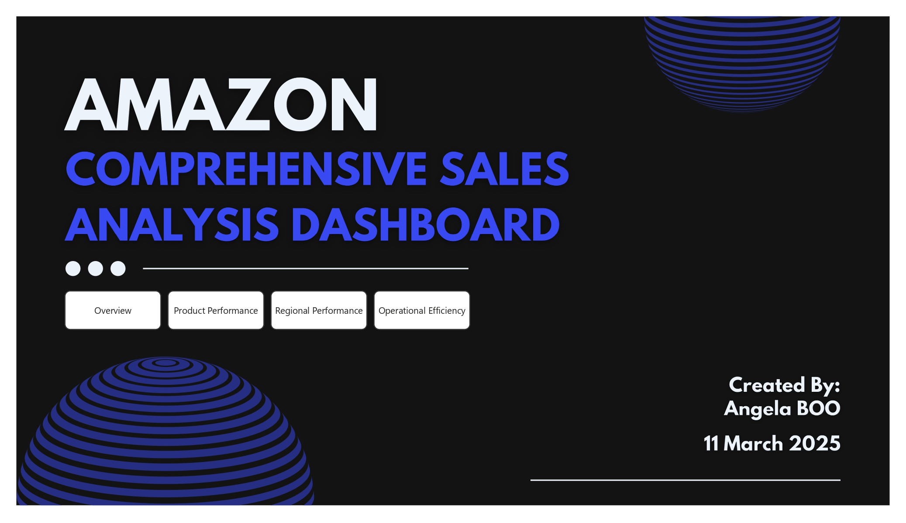
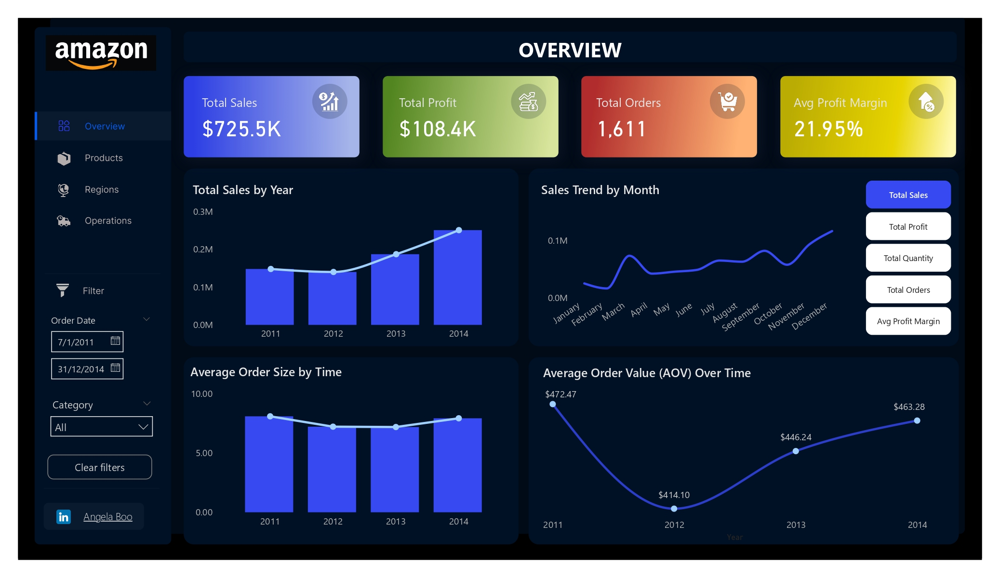

# Amazon Comprehensive Sales Analysis Dashboard

This project demonstrates a **Power BI dashboard** designed to analyze and visualize **Amazon's business performance over four years (2011–2014)**. It provides insights into sales trends, profitability, product performance, regional performance (by state and city), and operational efficiency.

 

## Features

- **Sales Trends Overview**: Visualizes total sales, total profit, total quantity, total orders, and average profit margin over time (year and month).
- **Average Order Insights**: Charts for average order size and average order value trends over time.
- **Product Performance Analysis**: Highlights average profit margins across product categories and identifies best-selling products.
- **Regional Sales Insights**: Analysis of sales and profit trends by state and city.
- **Operational Efficiency Metrics**: Includes shipping durations, delivery times, and performance comparisons.

 

## Power BI Dashboard Showcase

Here are the finalized pages of the dashboard:

1. **Cover Page**  
   

2. **Sales Trends Overview**  
   

3. **Product Performance Analysis**  
   

4. **Regional Sales Insights**  
   

5. **Operational Efficiency Metrics**  
   

 

## Dataset

The dataset used for this project is sourced from Kaggle: [Amazon Sales Dataset](https://www.kaggle.com/datasets/anandshaw2001/amazon-sales-dataset/data).

### Column Description:
- **`Order Date`**: Date when the order was placed.
- **`Ship Date`**: Date when the order was shipped.
- **`Email_ID`**: Email ID of the user placing the order.
- **`Geography`**: Location of orders (state and city).
- **`Category`**: Product category (e.g., Electronics, Furniture).
- **`Product Name`**: Name of the product.
- **`Sales`**: Sales revenue for the product.
- **`Quantity`**: Number of units sold.
- **`Profit`**: Profit generated from the sales.
  
 

## Tools Used

- **Power BI Desktop**: For data visualization and interactive reporting.
- **Canva**: For designing the cover page.
- **Figma**: For refining layouts and visuals.

 

## Explore the Project

- **Kaggle Notebook**: [View Notebook](https://www.kaggle.com/code/xiaotingb/amazon-sales-analysis-dashboard-power-bi)  
  Explore the notebook version of the analysis on Kaggle.

- **Dashboard PDF**: [Download PDF](./Amazon_Comprehensive%20Business%20Performance%20Dashboard.pdf)  
  Access the detailed dashboard report in PDF format.

 

## **Author**
**Angela Boo**  
- **GitHub**: [GitHub](https://github.com/angelaboo)  
- **Kaggle**: [Kaggle](https://www.kaggle.com/xiaotingb)  
- **LinkedIn**: [Connect with Me](https://www.linkedin.com/in/xxtt)  

Feel free to connect and explore my work!

 

## Disclaimer

**This project is intended solely for educational and portfolio purposes**. The dataset used in this project is sourced from [Kaggle](https://www.kaggle.com/datasets/anandshaw2001/amazon-sales-dataset/data) and does not represent real data from Amazon. All analyses, visualizations, and insights generated from this dataset are fictional and are created to demonstrate data analysis and visualization skills. This project is not affiliated with or endorsed by Amazon in any way.

 
